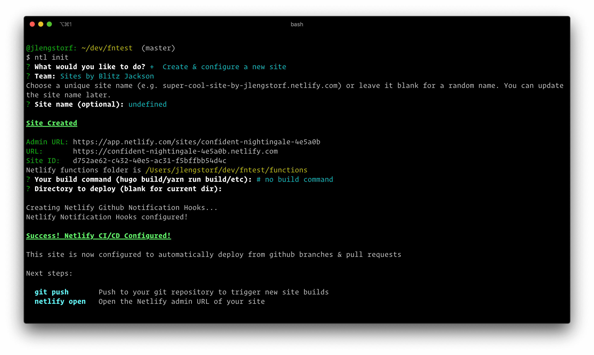
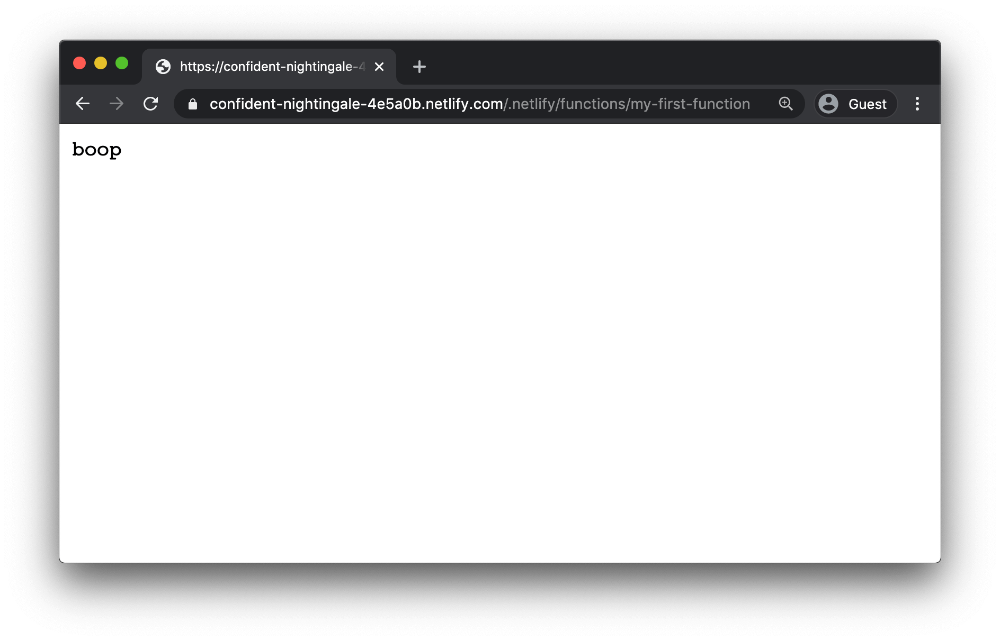

TKTK lead-up

### Write the serverless function

Our first step is to write the serverless function itself. In an empty folder, create a folder called `functions`, and create a new file called `my-first-function.js` inside with the following code:

```js
exports.handler = async () => ({
  statusCode: 200,
  body: 'boop',
});
```

There are three required components in a serverless function:

1. The file needs to export a function named `handler` — this is what `exports.handler` is doing on line 1 above
2. The function needs to return an object with a `statusCode` matching a valid HTTP response code
3. The response object also needs to include a `body` value, which is plain text by default

### Add the required configuration

With Netlify Functions, we only need two lines of configuration, which we need to save in `netlify.toml` at the root of the folder:

```toml
[build]
  functions = "functions"
```

This tells Netlify that our functions live in the `functions` folder.

### Create the repo and push to GitHub

At this point, we‘re ready to get this function on the internet!

Create a new repo on GitHub, then add and push our code to it:

```bash
# add your new repo as an origin
# IMPORTANT: make sure to use your own username/repo name!
git remote add origin git@github.com:yourusername/yourreponame.git

# add all the files
git add -A

# commit the files
git commit -m 'my first serverless function'

# push the changes to GitHub
git push -u origin master
```

### Create a new Netlify site

You can create your site through the Netlify dashboard or through the CLI. The CLI is really convenient and powerful, so let's use that for this site.

```bash
# install the Netlify CLI globally
npm install --global netlify-cli

# log into your Netlify account
netlify login

# initialize a new site
netlify init
```

This command will set up a new Netlify site in your account connected to the GitHub repo we just created.

It will ask several questions:

1. **What would you like to do?** — choose "Create & configure a new site"
2. **Team** — choose which Netlify team you want to add this site to
3. **Site name (optional)** — press enter to get a randomly-generated name, or choose one
4. **Your build command** — press enter to leave this blank; we don't need it for running functions
5. **Directory to deploy** — hit backspace to remove the suggested value, then press enter to leave it blank



Once the site has been created, we can grab the URL from the terminal output. In the above screenshot, the generated site name was:

```text
https://confident-nightingale-4e5a0b.netlify.com/
```

By default, Netlify functions live at the URL endpoint `/.netlify/functions/<function-name>` — this is to minimize the chances that the route will conflict with other routes on your site. (We can change this with redirects, which we'll look at later on.)

Our function file is called `my-first-function.js`, so it will be accessible on the web at [https://confident-nightingale-4e5a0b.netlify.com/.netlify/functions/my-first-function](https://confident-nightingale-4e5a0b.netlify.com/.netlify/functions/my-first-function) (go ahead and click that link — it works!).



That's all there is to it! You've successfully deployed your first serverless function to Netlify.

## What to do next

Learn how to [send back images from serverless functions](https://www.notion.so/jlengstorf/How-to-Send-Images-as-Responses-from-Serverless-Functions-7c9ba392d43d4fce94293a4d17653858).
